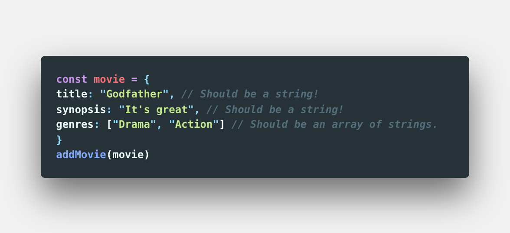

# Day16 of 42

> This challenge is based on videos #2.18 to #2.25:

- 1일간 시청하는 강의: #2.18 to #2.25
- 1일간 제출하는 과제: 위의 강의를 시청하신 후, 아래 코딩챌린지를 완료하세요.

 

[[노마드 코더] 유튜브 클론 코딩](https://academy.nomadcoders.co/courses/enrolled/435438)

`#2 ExpressJS`
- 2.18 Search Controller 
- 2.19 Join : Log In HTML 
- 2.20 Change Profile HTML 
- 2.21 Home Controller 
- 2.22 Home Controller part Two 
- 2.23 Join Controller 
- 2.24 Log In and User Profile Controller 
- 2.25 More Controlers 
 

 

---

 

## Lecture Summery

 

---

 

## Homework 

### 코딩챌린지 소개
    
- 오늘 코딩챌린지를 위한 샌드박스는 지난주 샌드박스와 모습이 매우 비슷합니다. (그러나 같진 않음!)
- db.js file, controllers, routers, 그리고 templates 이 이미 준비되어 있습니다. 
 
 

This is the expected output:   

 

### 조건:

- You need to create the route, controller and .pug template for the page /add.
- The /add page should be a form with three inputs: title, synopsis, genres. title and genres should be inputs and synopsis should be a text area.
- This form should POST to a page with a controller that calls the addMovie function and adds the movie with the fields from the form.
- The addMovie function takes one argument, that argument should be an object containing title, synopsis, genres.
    
- After the movie is created the user should be **redirected** back to ``/``
- Do everything in maximum TWO controllers.
- The form has to do a POST request.
- Use .pug
- You need to take the genres input from the frontend and learn how to turn it into an array on the backend. Separate it by commas ( **,** )  ``Drama, Comedy, Accion -> ["Drama", "Comedy", "Action"]``
- Not allowed to type the array from the frontend.
- The app must behave exactly like the video

### 제출:
- CodeSandbox 템플릿 : [Day16 Boilerplate](https://codesandbox.io/s/day-sixteen-blueprint-psoj7)
- 제출 : [Day16 Homework](https://codesandbox.io/s/day-sixteen-blueprint-jbbey)
- 정답 : [Day16 Answer](https://codesandbox.io/s/day-sixteen-solution-ou0k5)