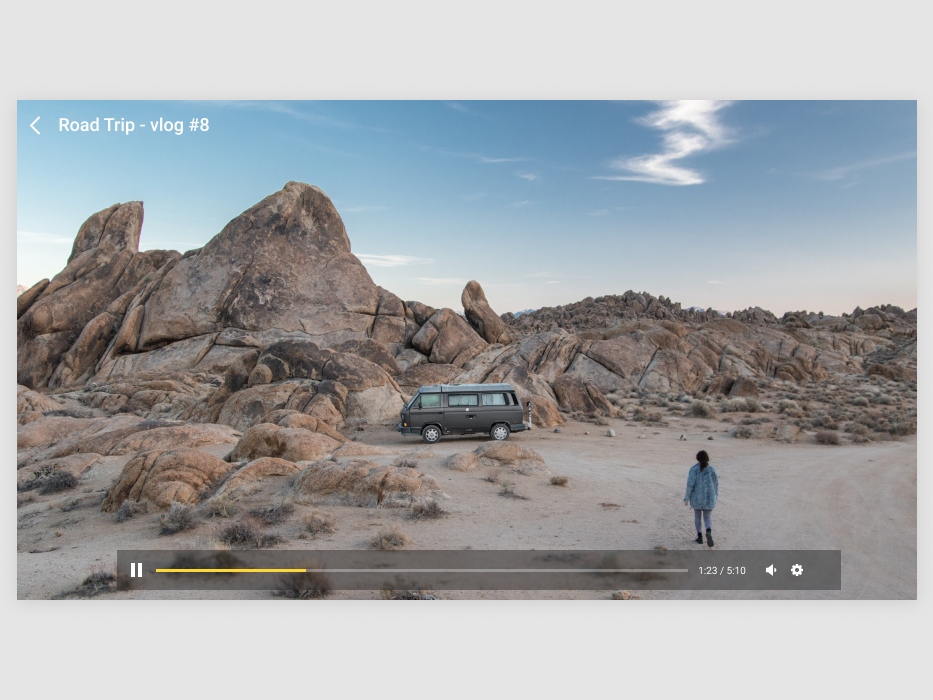

# Day29~30 of 42

> This challenge is based on videos #8.0 to #8.6

- 오늘 시청하는 강의: #8.0 to #8.6
- 과제: 위의 강의를 시청하신 후, 아래 코드 챌린지를 완료하세요.

<br/>

[[노마드 코더] 유튜브 클론 코딩](https://academy.nomadcoders.co/courses/enrolled/435438)

`#8 Custom Video Player`
- 8.0 Starting the Video Player 
- 8.1 Play Pause Functionallity 
- 8.2 Mute Unmute 
- 8.3 Enter Fullscreen Exit Fullscreen 
- 8.4 Total Time and Current Time 
- 8.5 Volume Bar part One 
- 8.6 Volume Bar part Two 
 
<br/>

---

<br/>

## Lecture Summery

<br/>

---

<br/>

## Homework 


 
<br/>

Build a simple API that I can use to check if a website is down.

With the provided blueprint, make an app that has this exact output:


<br/>


### 조건
- 아래 주어진 컨디션들을 모두 수행하여야 코딩챌린지를 통과할 수 있습니다.
- Play / Pause Button
- Show the player bar when the user hovers moves the mouse
- If the mouse does not move, hide the mouse and the player bar even if it's on top of the video.
- If I press the spacebar the video should play/pause
- Muted/Unmuted Button
- When the video finishes, make it restart automatically.
- Show Current Time / Total Time
- Use Fontawesome

<br/>

### 제출:
- CodeSandbox 템플릿 : [Day29 Boilerplate](https://codesandbox.io/s/videoplayer-blueprint-y9fvl)
- 제출 : [Day29 Homework](https://codesandbox.io/s/videoplayer-blueprint-m9l5m)
- 정답 : [Day29 Answer](https://codesandbox.io/s/videoplayer-solution-qqgg4)

```
index.html
src
├ index.js
⌊ index.js
```

<br/>

`index.html`
```html
<!DOCTYPE html>
<html>
  <head>
    <title>Video Player</title>
    <link
      rel="stylesheet"
      href="https://use.fontawesome.com/releases/v5.9.0/css/all.css"
    />
    <meta charset="UTF-8" />
  </head>

  <body>
    <div class="videoContainer">
      <video
        autoplay
        loop
        width="700px"
        src="https://serranoarevalo.github.io/notflix/9bfd1023900e31286103369c803c7ee9.ogv"
      ></video>
      <div class="controls">
        <span class="controlsColumn">
          <span class="playPauseBtn">
            <i class="fas fa-pause"></i>
          </span>
        </span>
        <span class="controlsColumn">
          <span class="timer"></span>
          <div class="soundBtn">
            <i class="fas fa-volume-up"></i>
          </div>
        </span>
      </div>
    </div>
    <script src="src/index.js"></script>
  </body>
</html>
```

<br/>

`index.js`
```javascript
import "./styles.css";

const videoContainer = document.querySelector(".videoContainer"),
  video = videoContainer.querySelector("video"),
  controls = document.querySelector(".controls"),
  playPauseBtn = controls.querySelector(".playPauseBtn"),
  soundBtn = controls.querySelector(".soundBtn"),
  timer = controls.querySelector(".timer");

let hideTimeout = null;

const showControls = () => {
  if (hideTimeout) {
    clearTimeout(hideTimeout);
  }
  controls.classList.add("showing");
  videoContainer.style.cursor = "default";
  hideTimeout = setTimeout(hideControls, 3000);
};

const hideControls = () => {
  controls.classList.remove("showing");
  videoContainer.style.cursor = "none";
};

const togglePlayPause = () => {
  const { paused } = video;
  if (paused) {
    video.play();
    playPauseBtn.innerHTML = `<i class="fas fa-pause"></i>`;
  } else {
    video.pause();
    playPauseBtn.innerHTML = `<i class="fas fa-play"></i>`;
  }
};

const handleTimeUpdate = e => {
  const { currentTime, duration } = video;
  const formattedTime = `${Math.floor(currentTime)}`.padStart(2, "0");
  const formattedDuration = `${Math.floor(duration)}`.padStart(2, "0");
  timer.innerHTML = `00:${formattedTime} / 00:${formattedDuration}`;
};

const handleKeyDown = e => {
  const { code } = e;
  if (code === "Space") {
    togglePlayPause();
  }
};

const toggleSound = e => {
  const { muted } = video;
  if (muted) {
    soundBtn.innerHTML = `<i class="fas fa-volume-up"></i>`;
    video.muted = false;
  } else {
    soundBtn.innerHTML = `<i class="fas fa-volume-mute"></i>`;
    video.muted = true;
  }
};

video.addEventListener("timeupdate", handleTimeUpdate);
videoContainer.addEventListener("mousemove", showControls);
videoContainer.addEventListener("mouseleave", hideControls);
playPauseBtn.addEventListener("click", togglePlayPause);
soundBtn.addEventListener("click", toggleSound);
document.addEventListener("keydown", handleKeyDown);
```

<br/>

`styles.css`
```css
body {
  font-family: sans-serif;
  background-color: #e5e5e5;
  display: flex;
  flex-direction: column;
  justify-content: center;
  align-items: center;
  height: 100vh;
}

.videoContainer {
  border-radius: 10px;
  overflow: hidden;
  box-shadow: 0 2px 4px rgba(50, 50, 93, 0.1);
  position: relative;
}

.videoContainer video {
  transform: scale(1.4);
}

.controls {
  background-color: rgba(70, 70, 70, 0.5);
  width: 600px;
  height: 40px;
  position: absolute;
  bottom: 25px;
  left: 0;
  right: 0;
  margin: 0 auto;
  opacity: 0;
  transition: opacity 0.5s ease-in-out;
  z-index: 10;
  display: flex;
  justify-content: space-between;
  align-items: center;
  padding: 0px 15px;
  color: white;
}

.controls.showing {
  opacity: 1;
}

.controls .playPauseBtn {
  cursor: pointer;
}

.controls .controlsColumn {
  display: flex;
}

.controlsColumn .soundBtn {
  margin: 0px 20px;
}
```

