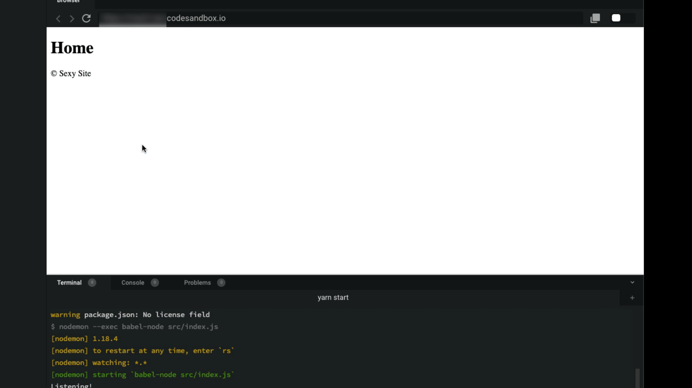

# Day5 of 42

> Today's challenge is based on videos #2.8 to #2.11

- 오늘 시청하는 강의: #2.12 to #2.17
- 오늘 제출하는 과제: 위의 강의를 시청하신 후, 아래 코딩챌린지를 완료하세요.

 

[[노마드 코더] 유튜브 클론 코딩](https://academy.nomadcoders.co/courses/enrolled/435438)

`#2 ExpressJS`
- 2.12 Recap 
- 2.13 Installing Pug 
- 2.14 Layouts with Pug 
- 2.15 Partials with Pug 
- 2.16 Local Variables in Pug 
- 2.17 Template Variables in Pug 

 

---

 

## Lecture Summery

### Pug

 

### app.set()

 

### 사용하기

### set
res.send => res.render('filename')
filename => src/views/filename.pug

views/layouts/template.pug
-> block content

#### layout
views/home.pug
-> 
extends layouts/template.pug
block content
    p hello
    
### partials

 

 

## Reference

 

---

 

## Homework 

### Challenge goals:

아래 주어진 컨디션들을 모두 수행하여야 코딩챌린지를 통과할 수 있습니다.

Using the provided blueprint build a server that has the following routes:

 

### 조건:

- Make FOUR (4) routes. / /login /photos /profile
- Each route should render a PUG template.
- NO Anonymous functions allowed. Every route should have a controller.
- Put the templates on the 'views' folder.
- All templates should extend from a layout.
- The layout should contain the <head> portion of the page and a <footer> partial.
- On the <body> each page has to have a <h1> with the title of the page.
- On the <head> each page has to have a <title> with the title of the page and the title of the website.
- The title of the page and the website should not be written on the template.
- The title of the page should come from the controller.
- The title of the website should not come from the controller, it should come from the locals.
- There should be one router file and one controller file.
- Middlewares should have their own file.

### 제출:
- CodeSandbox 템플릿 : [Day8 Boilerplate](https://codesandbox.io/s/express-pug-blueprint-qopyp)
- 제출 : [Day8 Homework](https://codesandbox.io/s/express-pug-blueprint-czp7f)
- 정답 : [Day8 Answer]()